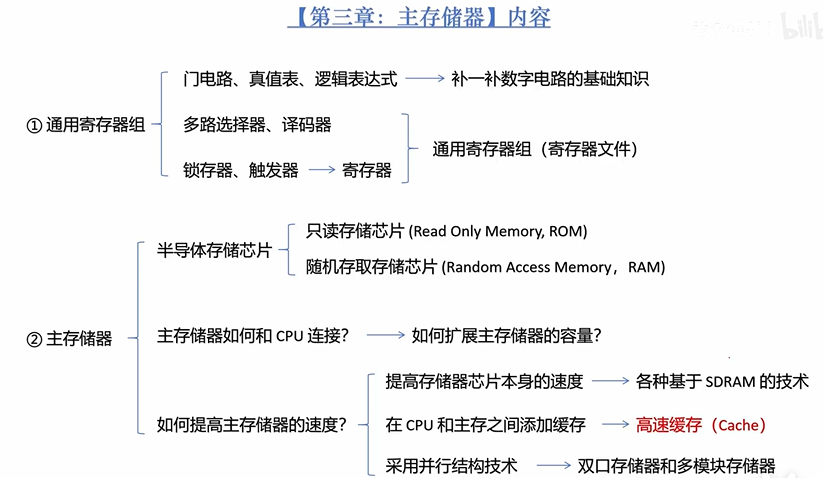
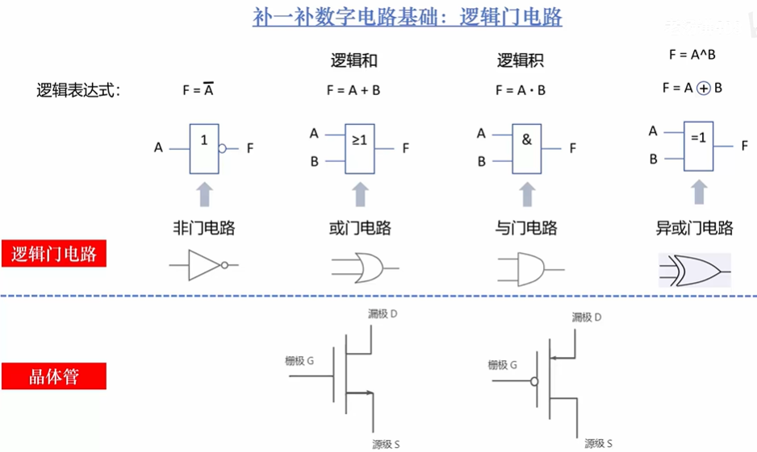
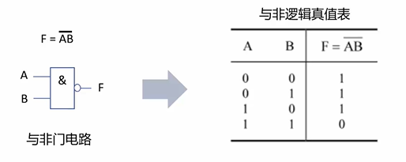
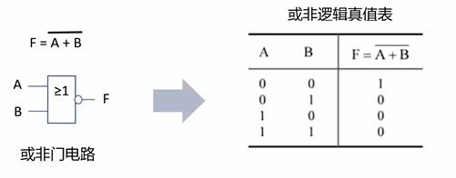
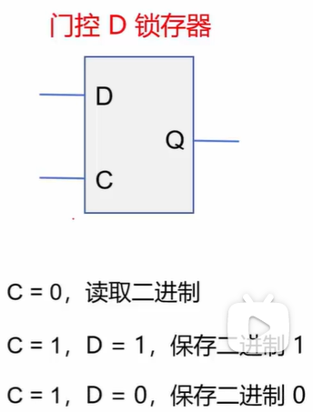

## 本章内容：

## 1.数字电路的基础知识   

### 1.逻辑门电路

### 2.真值表

真值表中该输出为 1 的表项对应一个乘积项  
乘积项为所有输入的乘积或输入取反后的乘积，是否取反取决于真值表中该变量对应的信号是 1 还是 0

> 根据真值表写：输出逻辑表达式

 ## 2.译码器、多路选择器和锁存器、触发器

### 1.译码器    
将输入转化成对应的十进制，然后将对应的输出设置为 1，其他的输出设置为 0

### 2.多路选择器

多路选择器（multiplexer）：简称 MUX。从多路输入数据中选择其中一路送至输出端。

### 2.锁存器和触发器 

在数字电路中，可以存储一个二进制位的器件称为存储单元电路，包括存器和触发器。

$锁存器$：（举例）

- 逻辑与非门电路  
 

- 逻辑或非门电路

 

#### 1.RS锁存器  
####  2.门控D锁存器

