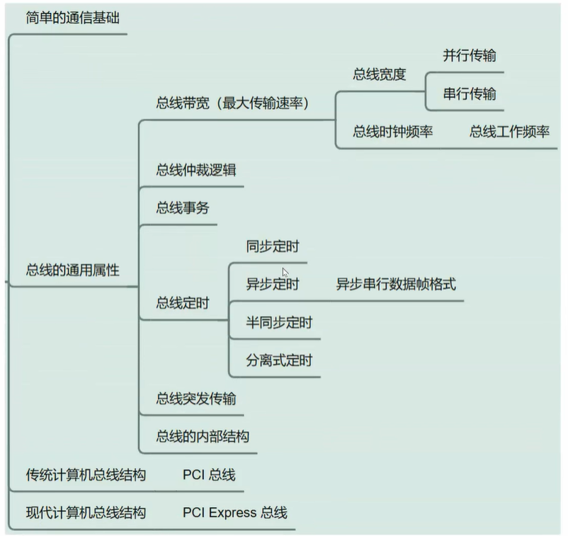
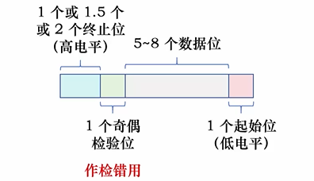
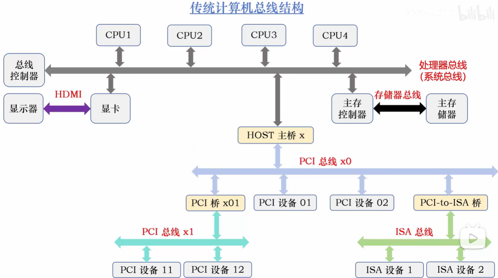
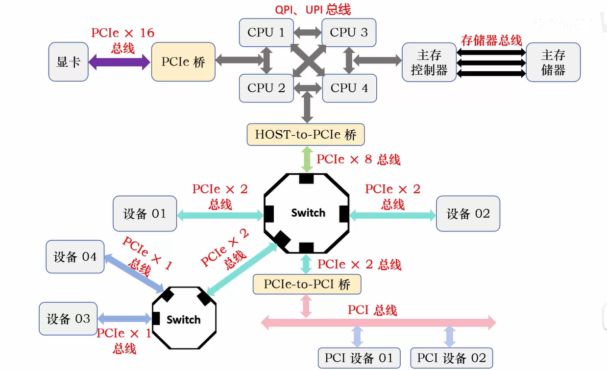

## 本章流程：

---

## 1.简单通信基础
连续数据——>模拟信号
离散数据——>数字信号

外同步法：单独发一条同步信号（时钟线 / 同步脉冲），接收端直接用。
自同步法：不单独发同步信号，从数据本身里提取同步。

## 2.总线的带宽

总线有总线控制器、仲裁器
#### 1.传输方式：
串行传输（远距离传输，成本低）、
并行传输（效率高，短距离传输）

#### 2.存储器总线：
控制线、地址线、数据线。总线宽带为数据线的条数。

#### 3.总线时钟频率：
每一种总线也有自己对应的时钟，它用于控制总线传输数据的节奏

总线时钟频率就是一秒内传输数据的次数，它的单位是赫兹。

100MHz 每秒传输 100M 次数据（1M = 10⁶）。

总线时钟周期 = 1/总线时钟频率

#### 4.总线带宽：
总线带宽是指总线的最大数据传输率,
即总线在进行数据传输时单位时间内最多可以传输的数据量

$$
\text{总线带宽} = \text{总线宽度} \times \frac{1s}{\text{总线时钟周期}} = \text{总线宽度} \times \text{总线时钟频率}
$$

总线宽度是 32 位，总线时钟频率是 33MHz

总线带宽 = $32 \, \text{bit} * 33\text{MHz} = (32 / 8) \, \text{B} * 33\text{MHz} = 132 \, \text{MB/s}$ （$1M = 10^6$）

#### 5.总线的工作频率：
早期的总线通常一个总线时钟周期传送一次数据，所以总线工作频率等于总线时钟频率

现在有些总线一个总线时钟周期内，可以传送 2 次或者 4 次数据

那么，总线工作频率等于总线时钟频率的 2 倍或者 4 倍

$$
\text{总线带宽} = \text{总线宽度} \times \text{总线工作频率}
$$

## 2.总线的仲裁逻辑
对总线有无控制权  
├── 主设备  
└── 从设备

两种仲裁方式  
├─ 集中式仲裁  
└─ 分布式仲裁

### 集中式仲裁
#### 1.链式查询方式  
BS、BR、BG 都属于控制总线，具体原因：  
BR（总线请求线）：设备向总线控制器发送请求信号  
BG（总线授权线）：总线控制器向设备发送授权信号   
BS（总线忙线）：指示总线当前状态的信号  

优点：只用很少几根线就能按一定优先次序实现总线仲裁，并且这种链式结构很容易扩充设备

缺点：对询问链的电路故障很敏感

#### 1.计数器定时方式  
优点：各设备的优先级是一样的，计数器的初值可以用程序来设置，这就可以方便的改变优先次序

缺点：增加控制线的数量  
有 15 个设备的话，至少需要 4 位二进制，2⁴ = 16

#### 1.独立请求方式  
优点：响应速度快，优先次序控制灵活

缺点：是控制线数量太多，总线控制更复杂

### 分布式仲裁

## 3.总线周期
总线周期：指完成一次总线操作（总线事务）的时间
阶段：① 申请分配阶段② 寻址阶段③ 数据传输阶段④ 结束阶段

## 4.总线定时
总线定时的 4 种方式  
① 同步定时（通信）  
② 异步定时（通信）  
③ 半同步定时（通信）  
④ 分离式定时（通信）

### 1.同步定时
操作事件出现在总线上的时刻由总线时钟信号来确定 

T1：主设备发送地址  
T2：主设备发送读命令  
T3：从设备提供数据  
T4：主设备撤销命令，从设备撤销数据

总线传输周期和总线周期是不一样的，总线周期比总线传输周期多了一步总线分配阶段
① 申请分配阶段② 寻址阶段③ 数据传输阶段④ 结束阶段

同步定时：适用于总线长度较短、各设备存取时间比较接近的情况

### 2.异步定时
允许总线上的设备存储时间不一致

1.不互锁方式  
主设备发送请求后，不需要从设备应答，便撤销请求信号，从设备在应答后直接撤销应答信号。

2.半互锁方式  
主设备发送请求后，需要从设备发送应答后，撤销请求信号，从设备可以直接撤销应答信号。

3.全互锁方式\
主设备发送请求后，需要从设备发送应答后，撤销请求信号，从设备在主设备撤销请求后，撤销应答。

### 3.半同步定时  
在同步定时的基础上，进行修改，某些操作的时间需要不止一个周期。允许总线上有速度相差比较大的设备进行通信。

### 4.分离式定时
 
总线传输周期  
├─ 第一个子周期：主设备发送地址、命令以及主设备的设备号给从设备  
└─ 第二个子周期：从设备准备数据后，申请总线控制权，然后将数据发送给主设备

## 5.总线数据传输方式

### 1.同步串行通信

### 2.异步串行通信   
异步通信不要求通信双方共享一个独立的时钟信号。相反，每个设备都有自己的独立时钟源。为了使接收方能够正确识别数据的开始和结束，发送方会在每个数据单元（通常是一个字节）的前后添加特定的标记，即起始位和停止位。

| 奇校验 | 偶校验 |
|--------|--------|
| 在数据传输或存储时，使包括校验位在内的整个数据中 “1” 的个数为**奇数** | 在数据传输或存储时，使包括校验位在内的整个数据中 “1” 的个数为**偶数** |

>空闲时间为高电平

### 3.波特率 
单位时间内传送二进制数据的位数，单位用 **bps (位/秒)** 表示，记作波特

**例子：**  
在异步串行传输系统中，假设每秒传输 120 个数据帧，其字符格式规定包含：
- 1 个起始位
- 7 个数据位
- 1 个奇校验位
- 1 个终止位  

试计算波特率：  
一帧包含 = 1 + 7 + 1 + 1 = **10 位**  
波特率为：(1 + 7 + 1 + 1) × 120 = **1200 bps = 1200 波特**

### 4.总线突发传输  
一次总线操作可以同时传输多个数据帧

## 6.总线结构   

多总线结构：\
分层的原则：速度差异较大的设备模块使用不同速度的总线，而速度相近的设备模块使用同一类总线

### 传统计算机总线结构

 

### 现代计算机总线结构
#### 1.QPI总线带宽

| 参数项 | 规格/数值 | 备注/说明 |
| :--- | :--- | :--- |
| **数据位宽** | 20 位 | 包含 16 位有效数据 + 4 位循环冗余校验位 (CRC) |
| **工作模式** | 全双工 | 支持双向同时传输 |
| **传输机制** | DDR (双倍速率) | 每个时钟周期内都可以传输两次数据 |
| | | |
| **配置 A** | | |
| 时钟频率 | 2.4 GHz | |
| 工作频率 | 4.8 GHz | 时钟频率 × 2 |
| 总线带宽 | **19.2 GB/s** | 计算公式：$4.8\text{GHz} \times 2\text{B} \times 2$ |
| | | |
| **配置 B** | | |
| 时钟频率 | 3.2 GHz | |
| 工作频率 | 6.4 GHz | 时钟频率 × 2 |
| 总线带宽 | **25.6 GB/s** | 计算公式：$6.4\text{GHz} \times 2\text{B} \times 2$ |

> **注：** 带宽计算公式中的 `2B` 代表 16位有效数据（即 2 Bytes），最后的 `× 2` 代表全双工模式（或上下行总和）。

#### 1.PCIe总线  
PCIe 总线是一个 **串行传送** 的 **点对点总线**

---
## 其他

常见的控制信号：

- 时钟信号：用来同步各种操作  
- 复位信号：初始化所有设备  
- 总线请求：表示某设备需要获得总线控制权  
- 总线授权：表示需要获得总线控制权的设备已获得总线控制权  
- 主存储器写：将数据线上的信息写到主存储器中指定地址的主存单元中  
- 主存储器读：将指定地址的存储单元中的数据读到总线上  
- I/O 读：从指定地址的 I/O 设备中数据读取到数据线上  
- I/O 写：将数据线上的数据写到指定地址的 I/O 设备中  
- 中断请求：表示某设备提出的中断请求  
- 中断响应：表示中断请求已接收

